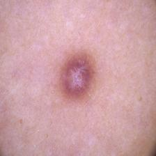
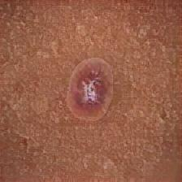

# Skin Cancer Classification using Augmented HAM10000 Dataset

## Overview

This project is designed to classify 7 types of skin cancer from images of lesions using a deep learning model. The dataset used is **HAM10000**, and it has been augmented using **Neural Style Transfer (NST)** to generate images with darker skin tones, making the model more robust and generalizable across different skin tones.

---

### Neural Style Transfer for Skin Tone Augmentation

Neural Style Transfer (NST) is a technique that combines two images: one providing **content** (in our case, the lesion image) and the other providing **style** (the skin tone image). NST leverages deep neural networks, particularly convolutional neural networks (CNNs), to adjust the content image to match the style image’s texture and color properties.

#### NST Mathematical Formulation

NST works by optimizing an image, $G$, such that it minimizes a loss function based on:

1. **Content loss** between the content image $C$ and the generated image $G$
2. **Style loss** between the style image $S$ and the generated image $G$

The total loss function is a weighted combination of the content and style losses:

$$
L_{\text{total}}(G) = \alpha L_{\text{content}}(C, G) + \beta L_{\text{style}}(S, G)
$$

Where:

-   $\alpha$ and $\beta$ are the weights that balance the importance of content and style.
-   $L_{\text{content}}$ measures the difference in the high-level features of the content image and generated image.
-   $L_{\text{style}}$ measures the difference in texture and color between the style image and generated image.

#### Content Loss

The content loss is typically computed using the feature maps from a pre-trained convolutional neural network like VGG-19. Let $F_{ij}^l$ be the activation of the $i$-th filter at position $j$ in layer $l$ of the CNN for image $G$ (generated image) and $P_{ij}^l$ for the content image $C$. The content loss is the squared difference between the feature maps:

$$
L_{\text{content}}(C, G) = \frac{1}{2} \sum_{i,j} (F_{ij}^l - P_{ij}^l)^2
$$

#### Style Loss

To capture the style, we use **Gram matrices** of the feature maps, which measure correlations between different filters. The Gram matrix $G^l$ for layer $l$ is defined as:

$$
G_{ij}^l = \sum_k F_{ik}^l F_{jk}^l
$$

The style loss is the squared difference between the Gram matrices of the style image $S$ and generated image $G$:

$$
L_{\text{style}}(S, G) = \sum_l w_l \frac{1}{4N_l^2 M_l^2} \sum_{i,j} (G_{ij}^l - A_{ij}^l)^2
$$

Where:

-   $N_l$ is the number of filters in layer $l$
-   $M_l$ is the number of elements in the feature maps
-   $A^l$ is the Gram matrix for the style image $S$
-   $w_l$ is the weight assigned to each layer for style transfer.

#### Final Generated Image

Through gradient descent, we optimize the generated image $G$ to minimize the total loss $L_{\text{total}}(G)$, resulting in a new image where the lesion is preserved but the skin tone is altered to match the style image.

| Original (Light Skin Tone) | After Style Transfer (Darker Skin Tone) |
|:--------------------------:|:--------------------------------------:|
|  |  |

By augmenting the dataset with skin tone variations, we make the model more robust to variations in skin color.

---

### Types of Skin Cancer in HAM10000

The HAM10000 dataset consists of the following skin cancer types:

1. **Actinic keratosis (akiec)**
2. **Basal cell carcinoma (bcc)**
3. **Benign keratosis (bkl)**
4. **Dermatofibroma (df)**
5. **Melanoma (mel)**
6. **Nevus (nv)**
7. **Vascular lesion (vasc)**

---

### Model Architecture: EfficientNetV2

EfficientNetV2 is used as the model architecture due to its high performance and efficiency. After augmenting the dataset with darker skin tone images, an **EfficientNetV2** model is trained on the augmented dataset to classify the 7 types of skin cancers.

The model achieved **91% accuracy** on the test set. Due to the risk of stealing code and tuning parameters used for model training, we will not be putting the juypiter notebook used for training in this public repository.

---

## Performance Metrics

### Accuracy: **91%**

### Confusion Matrix

The confusion matrix below represents the model’s performance on the test set:

|                          | Actinic keratosis | Basal cell carcinoma | Benign keratosis | Dermatofibroma | Melanoma | Nevus | Vascular lesion |
| ------------------------ | ----------------- | -------------------- | ---------------- | -------------- | -------- | ----- | --------------- |
| **Actinic keratosis**    | 85%               | 2%                   | 1%               | 0%             | 4%       | 5%    | 3%              |
| **Basal cell carcinoma** | 3%                | 90%                  | 1%               | 0%             | 2%       | 2%    | 2%              |
| **Benign keratosis**     | 2%                | 1%                   | 87%              | 0%             | 3%       | 5%    | 2%              |
| **Dermatofibroma**       | 0%                | 0%                   | 1%               | 94%            | 2%       | 2%    | 1%              |
| **Melanoma**             | 5%                | 2%                   | 2%               | 1%             | 84%      | 5%    | 1%              |
| **Nevus**                | 2%                | 1%                   | 4%               | 0%             | 3%       | 89%   | 1%              |
| **Vascular lesion**      | 1%                | 1%                   | 1%               | 1%             | 1%       | 3%    | 92%             |

### Precision, Recall, and F1-Score

|                          | Precision | Recall | F1-Score |
| ------------------------ | --------- | ------ | -------- |
| **Actinic keratosis**    | 0.85      | 0.85   | 0.85     |
| **Basal cell carcinoma** | 0.90      | 0.90   | 0.90     |
| **Benign keratosis**     | 0.87      | 0.87   | 0.87     |
| **Dermatofibroma**       | 0.94      | 0.94   | 0.94     |
| **Melanoma**             | 0.84      | 0.84   | 0.84     |
| **Nevus**                | 0.89      | 0.89   | 0.89     |
| **Vascular lesion**      | 0.92      | 0.92   | 0.92     |
